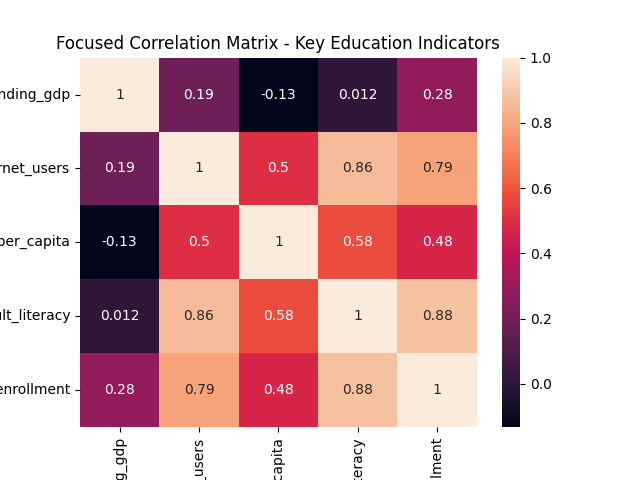
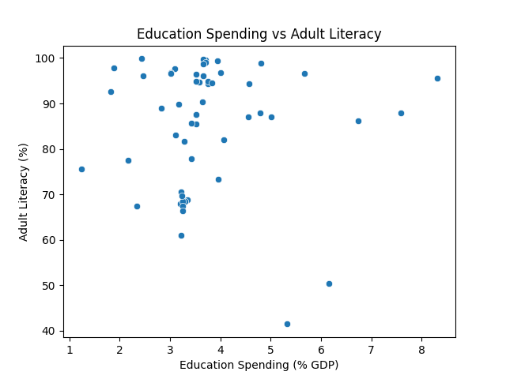
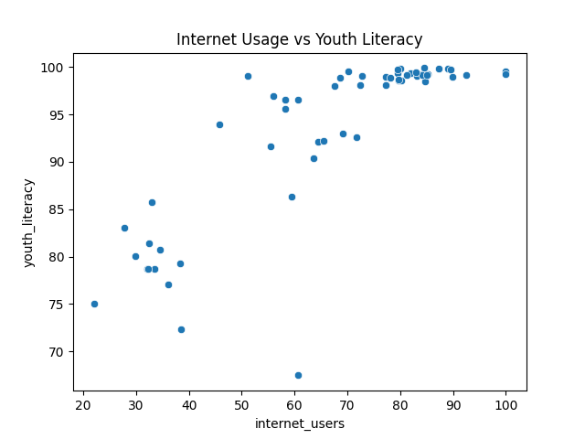

# Global Education Access vs Outcomes -> Exploratory Data Analysis
## Executive Summary

This project analyzes cross-country education and socioeconomic indicators to evaluate whether government education spending strongly correlates with measurable learning outcomes.
The analysis finds that digital access (internet penetration) demonstrates significantly stronger correlations with literacy and enrollment outcomes than government education spending as a percentage of GDP.
---
These findings suggest that structural enablers may play a more prominent role in educational performance than spending intensity alone.
## Project Overview

This project explores the structural relationship between national education investment and measurable education outcomes using publicly available World Bank data.
The core research question:
    Is higher government education spending associated with stronger literacy and enrollment outcomes?
    or do structural factors like digital access show stronger relationships?
---
## Data Sources
Data was fetched programmatically from the World Bank API using Python.
**Indicators used:**

1. Government education expenditure (% of GDP)
2. Adult literacy rate (%)
3. Youth literacy rate (%)
4. Secondary school enrollment (% gross)
5. Internet users (% of population)
6. GDP per capita (current US$)
7. Urban population (%)

Data range: 2018–2023
Countries analyzed: 256
---
## Methodology
1. Automated data fetching using World Bank API
2. Data cleaning and missing value handling
3. Merging multiple macroeconomic indicators
4. Exploratory Data Analysis (EDA)
5. Correlation analysis and visualization
---
## Key Findings
### Education Spending alone shows weak correlation
Government spending (% of GDP) showed weak correlation with literacy outcomes.
### Internet Access shows strong association.
Internet penetration demonstrated strong positive correlation with:
- Adult literacy
- Youth literacy
- Secondary enrollment
### Structural Variables matter
GDP per capita and urbanization show moderate correlation with literacy and enrollment.
---
## Visualisations
### Focused Correlation Matrix


### Education Spending vs Adult Literacy


### Internet Usage vs Youth Literacy

---
## Interpretation
Structural enablers such as digital access appear more strongly associated with educational outcomes than raw spending percentages.
---
## Analytical Insight
The weak correlation between education spending and outcomes may indicate:

- Variability in spending efficiency
- Structural inequality across countries
- Time-lag effects between investment and measurable outcomes

Conversely, strong internet–literacy correlations suggest that digital infrastructure may act as a multiplier for education systems in the modern context.
---
## Limitations
- Correlation-based analysis only  
- Cross-country macro data  
- No causal modeling  
---
## Tech Stack
- Python  
- Pandas  
- Seaborn  
- Matplotlib  
- World Bank API  
---
## Execution
```bash
pip install wbdata pandas matplotlib seaborn
python fetch_data.py
python analysis.py


